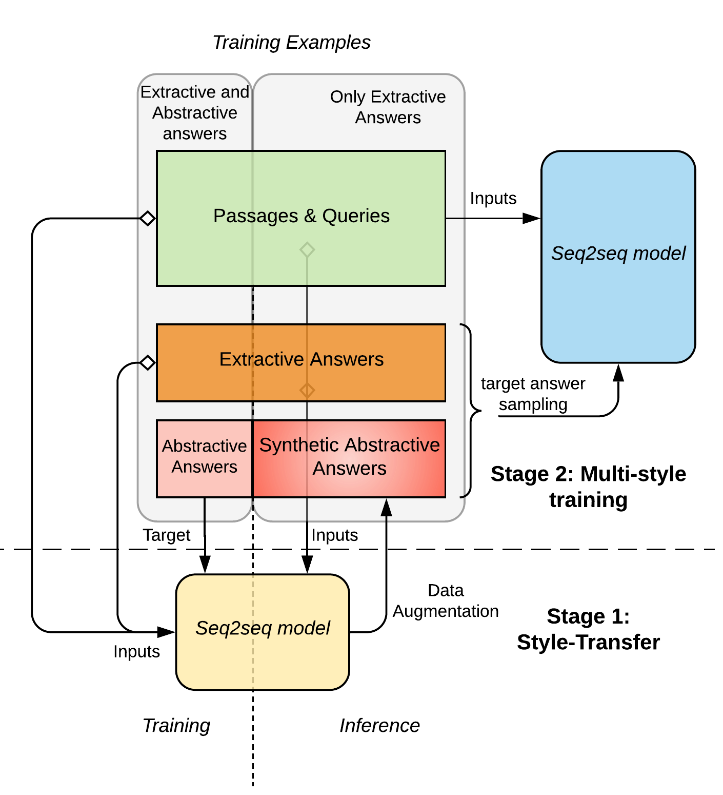
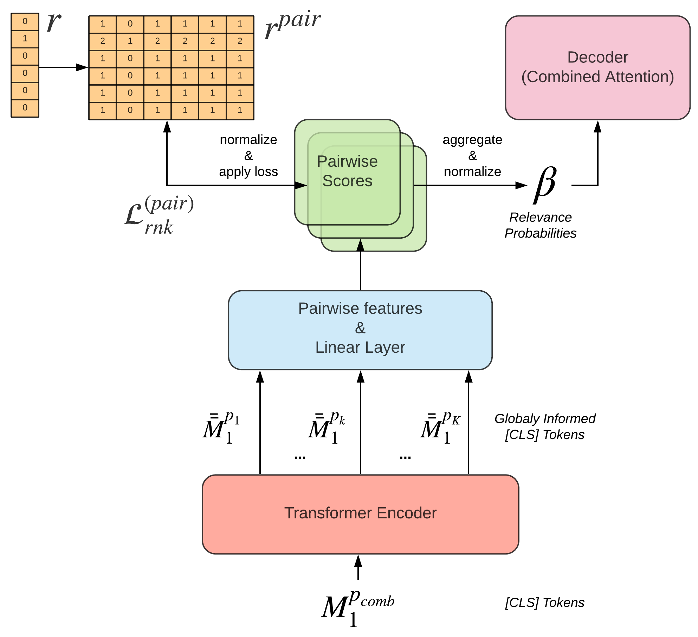
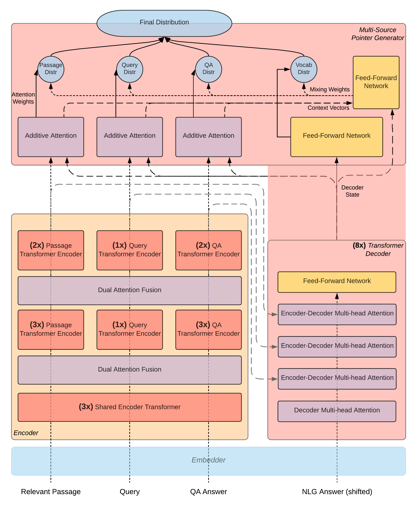
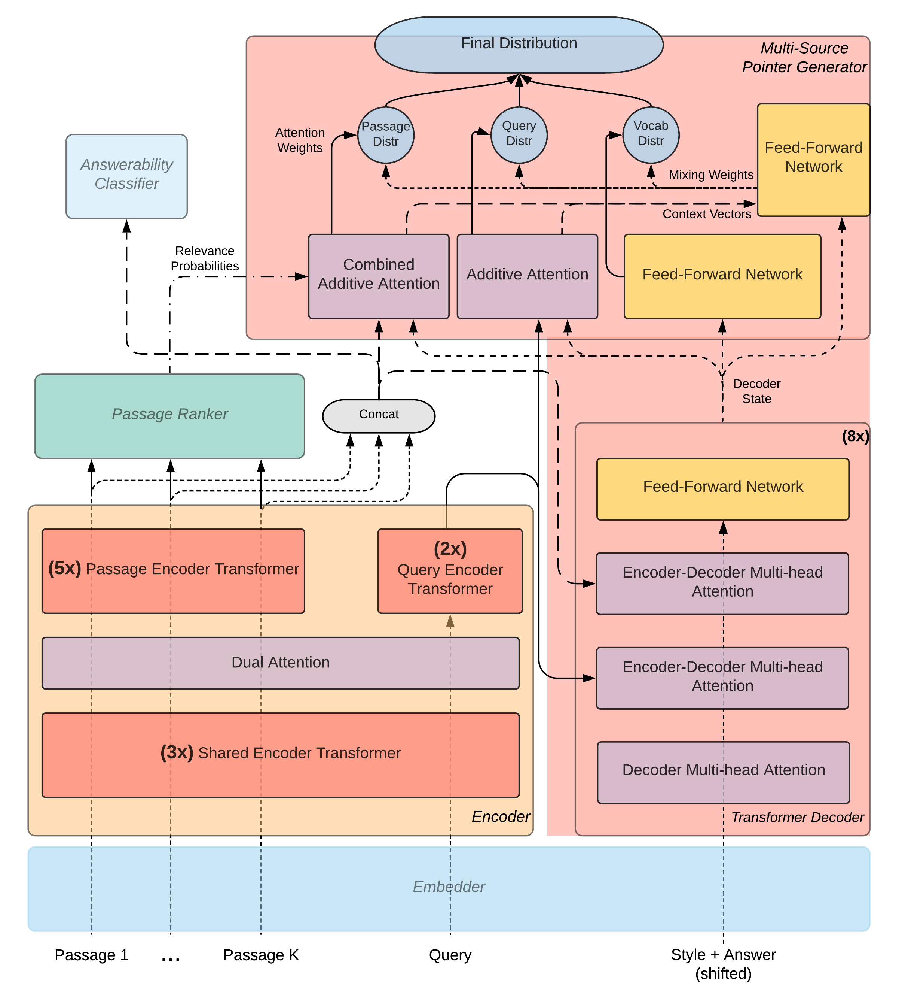

# Complex Question Answering by Pairwise Passage Ranking and Answer Style Transfer
[](https://www.python.org/) [](https://pytorch.org/docs/1.3.0/)

MSc AI Thesis at the University of Amsterdam, July 2020

## Abstract

   <em>Complex question answering (QA) refers to the task where a non-factoid query is answered using natural language generation (NLG), given a set of textual passages. A vital component of a high-quality QA system is the ability to rank the available passages, and thus focus on the most relevant information during answer generation. Another critical component of a QA system is learning from multiple answering styles, extractive, or abstractive through a process called multi-style learning, which helps to increase the performance of the individual styles by developing style-agnostic question answering abilities. This research tackles complex question answering, by focusing on these two essential features of a system, aiming to provide an improved framework for the task. Firstly, ranker modules are usually pointwise, ranking the passages in an absolute way by considering each of them individually from the rest, which is a potential bottleneck to their performance. Thus, in this research, an attention-based pairwise ranker is proposed that ranks passages in a relative way, by identifying the comparable relevance of each passage to the rest. Secondly, it is questionable whether multi-style learning is sufficient to combat the common data shortage in the abstractive-styled answers, which possibly leads to the style being under-trained. To mitigate this, a Style-transfer model is introduced, that first learns a mapping from the extractive to the abstractive style and is subsequently used to generate synthetic abstractive answers that can be utilized during multi-style training. The recently proposed Masque model (Nishida et al., 2019), which is a multi-style QA model that uses a pointwise ranker, serves as a baseline for this thesis's experiments. Inspired by the Masque architecture, PREAST-QA is proposed by combining both pairwise ranking and style transfer. PREAST-QA achieves competitive results in the MS-MARCO v2.1 NLG task and an improvement of 0.87 ROUGE-L points in abstractive answer generation over the Masque baseline. The success of the proposed model can be attributed to its increased ranking abilities and its use of high-quality synthetic data generated from the Style-transfer model, which further signifies the positive effects of multi-style learning, especially for low-resource query types.</em>
   
Multi-style learning with synthetic abstractive answers |  Pairwise Passage Ranking
:-------------------------:|:-------------------------:
  |  

## Features

- __models__
   : A library of various specialized components for the encoder-decoder models used in this research that are able to process multiple sequences, including transformer blocks, pointer-generators, dual and triple co-attentions. It additionally includes an implementation of the pairwise passage ranker, that is proposed in this research.

- __question_answering__
   : The modules to initialize a Masque or PreastQA model and train it using multi-style and multi-task learning, and evaluate its performance. Masque is implemented following the methodology described in [Multi-style Generative Reading Comprehension](https://arxiv.org/abs/1901.02262).

- __style_transfer__
   : The modules to initialize a Style-transfer model that learns how to create an abstractive (nlg-style) answer from an extractive (qa-style) one. The model is trained on quadruplets of (relevant passage, query, extractive answer, abstractive answer) and can then be used on inference mode to enrich the dataset with 300k more synthetic abstractive answers.

## Results

| Model | Abstractive Answer Generation (ROUGE-L) | Passage Ranking (MAP) | Answerability Classification (F1) |
| :---: | :---: | :---: | :---: | 
| Masque | 67.60 | 68.49 | 78.41 |
| PreastQA | **68.47** | **69.16** | **79.81** |

## Examples
_________________________________
**Query**: we elect a u.s. representative for how many years?

**Relevant Passage**: Two (2) years. You elect a member of the US House of Representatives every two years.
Senate members serve for six years. Representatives of the US Congress serve two-year terms, with elections
being held in all years that are even numbered.

**Reference Answer**: You elect a member of the US House of Representatives every two years

**Masque Answer**: we elect a u. s. representative for 2 years.

**PreastQA Answer**: we elect a member of the us house of representatives every two years.

________________________________

**Query**: chlorophyll can be found in _____.

**Relevant Passage**: Chlorophyll (also chlorophyl) is a term used for several closely related green pigments
found in cyanobacteria and the chloroplasts of algae and plants. Its name is derived from the Greek words
chloros (green) and phyllon (leaf).

**Reference Answer**: Chlorophyll can be found in cyanobacteria and the chloroplasts of algae and plants.

**Masque Answer**: chlorophyll can be found in cyanobacteria.

**PreastQA Answer**: chlorophyll can be found in cyanobacteria and the chloroplasts of algae and plants.

__________________________________

**Query**: why don’t cats like water

**Relevant Passage**: The main reason, that cats don’t like water, is that it causes them to lose body heat.
However, this is only if they are forced into a body of water, most cats are ok with getting a little wet if
they can help it. Some cats actually enjoy water, to the point where they will happily take baths, and
swim around.

**Reference Answer**: The main reason, that cats don’t like water, is that it causes them to lose body heat.

**Masque Answer**: don’t cats like water because of their sensitivity to its odor.

**PreastQA Answer**: cats don ’ t like water because it causes them to lose body heat.

________________________________

## Usage

The code is compatible with:

  * `python 3.6.3`
  * `pytorch 1.3.1`
  * `CUDA 10.1.243`

### installation 

```bash
pip install -r requirements.txt
```

### data

1. Download the [MS MARCO Question Answering V2.1 official data](https://microsoft.github.io/msmarco/) and extract the .gz files to [data](data)

2. Download the [300d GloVe embeddings](https://nlp.stanford.edu/projects/glove/) and extract the .gz file to [data](data)


## Extractive-to-Abstractive Answer Style-transfer task

Transformer-based encoder-decoder that models the following conditional probability

<center><a href="https://www.codecogs.com/eqnedit.php?latex=P\big(y|e,&space;p,&space;q&space;\big)" target="_blank"></a></center>

Where y is the nlg-style answer sequence, e is the qa-style answer sequence, p is the relevant passage sequence and q is the query sequence.

<center></center>

### train the model

```
python style_transfer/st_train.py --run_name $st_model_x --saving --dataset_name train
```

### generate synthetic abstractive answers

```
python style_transfer/st_eval.py --run_name $st_model_x --mode infer --dataset_name train
```

## Question-Answering task

Transformer-based encoder-decoder that models the follwing conditional probability

<center><a href="https://www.codecogs.com/eqnedit.php?latex=P\big(y,&space;\alpha,&space;\{r\}_1^K&space;\big|&space;q,&space;\{p\}_1^K,&space;s&space;\big)" target="_blank"></a></center>

Where y is the answer sequence, alpha is the answerability label, r<sub>k</sub> is the relevance label for the k-th passage, q is the query sequence, p<sub>k</sub> is the k-th passage sequence and s is the style label.

<center></center>

### train a Masque model

```
python question_answering/qa_train.py --include_dec --include_rnk --include_cls --rnk_method pointwise --cls_method linear --gamma_rnk 0.5 --gamma_cls 0.1 --run_name $qa_model_x --dataset_name train --saving
```

### train a PreastQA model

It is based on Masque but it additionally uses data generated from a checkpoint c of a style-transfer model st_model_x. For passage ranking it uses a pairiwse ranker with a passage-to-passage transformer instead of a pointwise ranker and for answerability classification it uses a max-pooling classifier instead of a linear layer.

```
python question_answering/qa_train.py --include_dec --include_rnk --include_cls --rnk_method pairwise --include_rnk_transformer --cls_method max --gamma_rnk 0.265 --gamma_cls 0.1 --use_nlg_gen_answers --generated_nlg_answers_path style_transfer/evaluation/$st_model_x/$c/predictions_infer.json --run_name $qa_model_x --dataset_name train --saving
```

### generate answer hypotheses

In abstractive mode (using the nlg style):

```
python question_answering/qa_eval_dec.py --run_name $qa_model_x --available_styles nlg --subset_name NLG --dataset_name dev
```

In extractive mode (using the qa style):

```
python question_answering/qa_eval_dec.py --run_name $qa_model_x --available_styles qa --subset_name ANS --dataset_name dev
```

to evaluate the answer hypotheses use the [official evaluation scripts](https://github.com/microsoft/MSMARCO-Question-Answering) of the MS MARCO dataset

### generate predictions for passage ranking and answerability classification

```
python question_answering/qa_eval_enc.py --run_name $qa_model_x --subset_name ALL --dataset_name dev
```

## tips

All the models can run efficiently using data parallelism and multiple workers for the dataloader. The default settings are optimized for a machine with 4 gpus (GeForce GTX 1080 Ti) and 12 cpu cores. In case of multiple gpus being available it is recommended to use the [custom batch sampler](question_answering/qa_batch_sampler.py) to balance the load of each gpu. The number optimal number of workers for the dataloader should be set half the number of cpu cores. 
